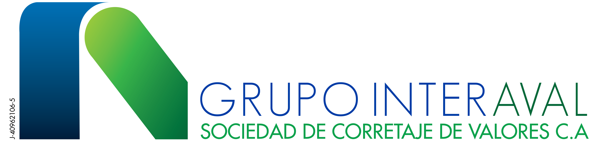

  

**Grupo Interaval** emerge como una firma especializada en servicios de banca de inversión en Venezuela. Nuestro equipo brinda asesoría en la ejecución de transacciones financieras y desarrollamos estrategias personalizadas de acuerdo a las necesidades de nuestros clientes, con la experiencia y conocimiento en el mercado financiero nacional e internacional de profesionales y expertos en cada área de negocio. 

A través del presente sitio web colocamos a disposición del público general información actualizada y organizada del mercado de valores venezolano, agrupando información de relevancia en torno al Índice General de la Bolsa de Valores de Caracas así como de cada una de las compañías emisoras que participan en el mercado, ofreciendo también información de algunas variables macroeconómicas de relavancia para el contexto económico venezolano.

**Nota**: actualizamos la información de acuerdo a como evoluciona el mercado y el comercio de los títulos, por lo que el reporte de algunas acciones pueden ser más activo que otros. Generalmente **después de las 4:00 pm** podrá ver la mayoría de la información actualizada. **Recomendamos abrir esta herramienta desde el computador**, aunque se adapta correctamenta a los dispositivos móviles, podrá disfrutar de todas sus ventajas si la usa desde una computadora de escritorio o laptop.

Este proyecto va en sintonía con la necesidad de proveer cada vez más y mejores herramientas que permitan a los inversores educarse y adentrarse al mercado de valores venezolano, ampliando y diversificando los canales de información. Esperamos que esta herramienta sea de provecho. Estaremos atentos a sus observaciones, reportes de errores, fallas o sugerencias a través de redes sociales o a los correos: info@grupointeraval.com, a.guipe@grupointeraval.com. 

**La información publicada en este sitio no representa una recomendación de inversión. Grupo Interaval C.A. proporciona esta información como un servicio a inversores y reporta la evolución de las acciones con base a los datos suministrados, recopilados y estandarizados por la Bolsa de Valores de Caracas.**

<a href="http://inversores.grupointeraval.com" class="btn btn-primary" role="button">Invierte con nosotros</a>
  
